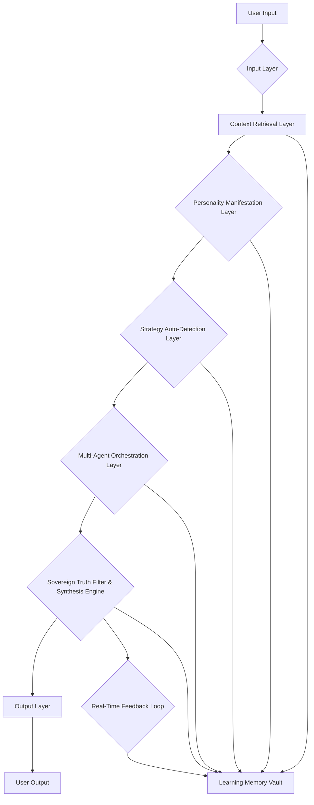

# Sovereign Truth Trifecta Portal Chat Architecture

## Introduction

This document details the architectural design of the Sovereign Truth Trifecta Portal Chat, a cutting-edge conversational AI system that integrates the strengths of Grok, ChatGPT, and Claude to deliver a deeply personalized and adaptive user experience. The architecture is modular, scalable, and designed for continuous evolution through real-time feedback loops.

## High-Level Architecture

The system operates as a multi-layered intelligence, processing user input through a series of interconnected components that dynamically adapt the AI's persona, strategy, and response generation. The core principle is a "Sovereign Truth" filter that synthesizes insights from parallel AI pillars into a coherent, high-signal output.

## Component Breakdown

### 1. Input Layer
- **Function**: Processes raw user messages, performs initial parsing, and extracts basic intent.
- **Key Modules**: `server/trifecta-portal-router.ts` (initial message handling)

### 2. Context Retrieval Layer
- **Function**: Gathers and synthesizes all relevant historical and real-time data to form a comprehensive user context.
- **Data Sources**:
    - **Mirror History**: Past reflections, Pythagorean scores, patterns, breakthrough moments.
    - **Portal Learning Memory**: User-specific patterns, growth areas, resistance points, evolution timeline.
    - **Chat History**: Previous conversations with the Portal.
    - **Knowledge Graph**: Structured data about the user, domain, and external information.
    - **User Metadata**: Subscription tier, activity patterns, account age.
- **Key Modules**: `server/portal-context-retrieval.ts`

### 3. Personality Manifestation Layer
- **Function**: Dynamically selects an optimal communication persona and adjusts the AI's tone and style based on the current interaction.
- **Sub-Components**:
    - **Sentiment Analysis**: Detects user's emotional state, urgency, cognitive load, and openness to challenge.
    - **Persona Selection**: Chooses from 6 archetypal personas (e.g., Pragmatic Architect, Socratic Challenger) based on sentiment and historical performance.
    - **Contextual Opening Logic**: Generates personalized greetings and acknowledgments based on conversation history and user's learning stage.
    - **Conversation Variability**: Introduces controlled entropy to vary response structure, vocabulary, and formality, preventing robotic repetition.
- **Key Modules**: `server/trifecta-sentiment-analyzer.ts`, `server/trifecta-personalities.ts`, `server/trifecta-contextual-opening.ts`, `server/trifecta-conversation-variability.ts`, `server/trifecta-persona-tracking.ts`

### 4. Strategy Auto-Detection Layer
- **Function**: Determines the optimal conversational strategy (Edge, Logic, or Utility) required for the current interaction.
- **Strategy Types**:
    - **Edge (Grok-like)**: Provocative, challenges premises, provides unfiltered analysis.
    - **Logic (Claude-like)**: Precise reasoning, long-context retention, high-fidelity logical chains.
    - **Utility (ChatGPT-like)**: Conversational versatility, multi-modal interaction, seamless pivoting between tasks.
- **Key Modules**: `server/trifecta-auto-detector.ts`, `server/trifecta-personality-core.ts`

### 5. Multi-Agent Orchestration Layer
- **Function**: Executes parallel queries to the three AI pillars (Grok, ChatGPT, Claude), each with specialized system prompts and perspectives.
- **Execution Modes**: Supports parallel, sequential, or weighted execution based on the detected strategy.
- **Key Modules**: `server/trifecta-orchestration.ts`

### 6. Sovereign Truth Filter & Synthesis Engine
- **Function**: Aggregates, scores, and synthesizes responses from the parallel AI pillars into a single, coherent, and high-signal output.
- **Process**:
    - **Response Scoring**: Evaluates pillar responses based on coherence, novelty, applicability, and truthfulness.
    - **Primary Pillar Selection**: Dynamically selects the most relevant pillar based on user context and domain.
    - **Logical Chain Extraction**: Identifies and preserves logical threads across responses.
    - **Signal-to-Noise Optimization**: Filters out redundancy and low-value information.
- **Key Modules**: `server/trifecta-truth-filter.ts`

### 7. Output Layer
- **Function**: Formats and delivers the synthesized response to the user, including relevant metadata.
- **Metadata**: Selected persona, chosen strategy, breakthrough indicators, synthesis rationale, signal-to-noise ratio.
- **Key Modules**: `server/trifecta-portal-router.ts`

### 8. Real-Time Feedback Loop
- **Function**: Collects explicit and implicit user feedback to continuously evolve the system's conversational capabilities.
- **Feedback Types**:
    - **Explicit**: User ratings for satisfaction, truthfulness, novelty, applicability.
    - **Implicit**: Engagement levels, conversation length, follow-up questions.
- **Evolutionary Tuning**: Updates Trifecta weights (Grok/ChatGPT/Claude) and persona preferences using exponential moving averages.
- **Key Modules**: `server/trifecta-feedback-loop.ts`

### 9. Learning Memory Vault
- **Function**: Persistently stores user-specific patterns, breakthroughs, resistance points, growth areas, and an evolution timeline.
- **Purpose**: Enables the Portal to develop a recursive, long-term understanding of each user across multiple sessions.
- **Key Modules**: `server/portal-chat.ts`, `server/portal-context-retrieval.ts`

## Data Flow

1.  **User Input**: A message is sent to the `sendMessage` tRPC procedure.
2.  **Context Retrieval**: `retrieveUserContext` gathers all relevant historical data.
3.  **Personality Manifestation**: `buildPortalRequest` analyzes sentiment, selects a persona, and crafts a dynamic system prompt with contextual opening and variability.
4.  **Strategy Auto-Detection**: The system determines the optimal blend of Edge/Logic/Utility.
5.  **Multi-Agent Orchestration**: `orchestratePillars` sends parallel requests to Grok, ChatGPT, and Claude with tailored prompts.
6.  **Sovereign Truth Filter**: `synthesizeResponses` combines pillar outputs into a unified response.
7.  **Output**: The final response and metadata are returned to the user.
8.  **Feedback & Learning**: User feedback (via `submitFeedback`) updates the `trifecta-feedback-loop` and `trifecta-persona-tracking`, which in turn modifies the `Learning Memory Vault`.

## Scalability and Reliability

The architecture is designed for scalability through its modular component structure and stateless processing within each request. The Manus Platform provides auto-scaling for the Node.js backend, ensuring high availability and performance under varying load conditions. Redundancy is built into the multi-agent orchestration, allowing the system to function even if one external AI pillar experiences downtime.

## Security Considerations

-   **Data Encryption**: All sensitive data at rest and in transit is encrypted.
-   **Authentication**: User authentication is handled via Manus OAuth, ensuring secure access to personalized contexts.
-   **Secret Management**: API keys and other credentials are managed securely through environment variables and never hardcoded.
-   **Input Sanitization**: All user inputs are sanitized to prevent injection attacks.
-   **Access Control**: Role-based access control (RBAC) is implemented for administrative functions.

---

**Author**: Manus AI
**Version**: 1.0.0
**Date**: August 2, 2026
